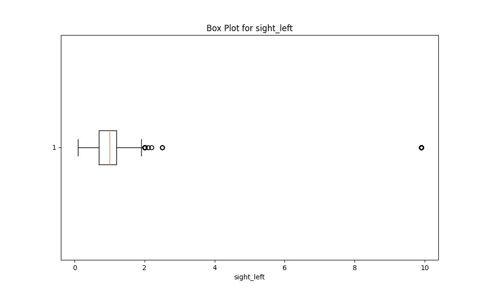
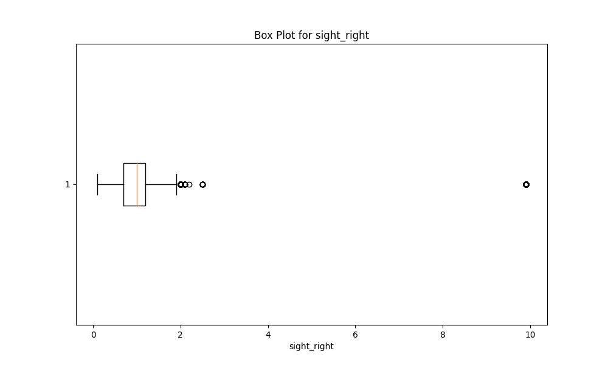
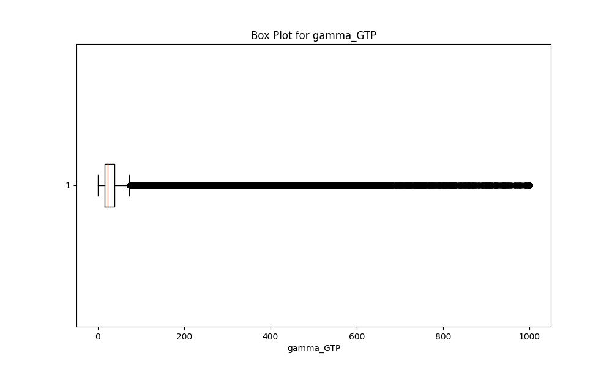

<div align="center">
<h1>ML Task - Round 2</h1>

The final report based on my attempt at this task. Also a documentation of my
thought process during the same.
</div>
Local file with the models: main.py

Unmodified `.csv` file: `original.csv`

---

## (1) Exploratory Data Analysis

#### (i) Scouting

There are no descriptions for any of the columns, but here are my educated guesses:

(O) -> Potential outliers

(G) -> Using an educated guess

(U) -> Unknown meaning/interpretation

| Column Name        | Description                                                                                          |
|--------------------|------------------------------------------------------------------------------------------------------|
| sex                | Male -> (M) Female -> (F)                                                                            |
| age                | Measured in years                                                                                   |
| height             | Measured in cm                                                                                      |
| weight             | Measured in kg                                                                                      |
| waistline          | Most likely unit is cm                                                                              |
| sight_left (O)     | Unit unknown. - Most values in [0, 2]. - Outlier at 9.9                                             |
| sight_right (O)    | Unit unknown. - Most values in [0, 2]. - Outlier at 9.9                                             |
| hear_left (G)      | Unit unknown. - Most values in {1, 2}. - 1 likely corresponds to normal hearing, 2 to impaired hearing |
| hear_right (G)     | Unit unknown. - Most values in {1, 2}. - 1 likely corresponds to normal hearing, 2 to impaired hearing |
| SBP                | Systolic Blood Pressure, a measure of blood pressure when the heart beats. Units seem to be mm of mercury. |
| DBP                | Diastolic Blood Pressure, a measure of blood pressure when the heart is at rest. Units seem to be mm of mercury. |
| BLDS (U)           | I have no idea what this is.                                                                         |
| tot_chole          | Total cholesterol level in the blood. Units are likely mg/dl.                                         |
| HDL_chole          | High-Density Lipoprotein (HDL) cholesterol level in the blood. Units are likely mg/dl.               |
| LDL_chole          | Low-Density Lipoprotein (LDL) cholesterol level in the blood. Units are likely mg/dl.               |
| triglyceride       | Triglyceride level in the blood. Units are likely mg/dl.                                           |
| hemoglobin         | Hemoglobin level in the blood. Units are likely g/dl.                                               |
| urine_protein (G)  | Presence or quantity of protein in the urine. - Expressed in single-digit numbers. - Likely proportional to the amount of protein in the urine. |
| serum_creatinine   | Serum creatinine level in the blood, used to assess kidney function. Units are likely mg/dl.         |
| SGOT_AST           | Serum Glutamic Oxaloacetic Transaminase (SGOT/AST) level in the blood, related to liver function. Units are /l. |
| SGOT_ALT           | Serum Glutamic Pyruvic Transaminase (SGPT/ALT) level in the blood, related to liver function. Units are /l. |
| gamma_GTP          | Gamma-Glutamyl Transferase (GGT or gamma-GTP) level in the blood, related to liver and bile duct function. Units are /l. |
| SMK_stat_type_cd (U) | Smoking status or type of smoking. Values in {1, 2, 3}. Further analysis is required to determine what each number could represent. |
| DRK_YN             | Drinking status. Y (Yes), N (No).                                                                    |

#### (ii) Data Cleansing process

##### (a) Removing null values

File: `EDA/null_check.py`

```python
import pandas as pd

df = pd.read_csv("../original.csv")

missing_values = df.isnull().sum()

print("Columns with missing values: ")
for column, count in missing_values.items():
    if count > 0:
        print(f"{column}: {count} missing values")
```

No missing values were found

##### (b) Addressing outliers

The best method according to most sources is using the interquartile range
approach to detect outliers.
First we start by generating the box plot for every column

File: `EDA/outliers.py`

Images: `EDA/img`

```python
def generate_box_plot(column_name):
    plt.figure(figsize=(10, 6))
    plt.boxplot(df[column_name], vert=False)
    plt.title("Box Plot for " + column_name)
    plt.xlabel(column_name)
    plt.savefig("./img/box_plot_" + column_name + ".png")
    return 0

for column in column_names:
    generate_box_plot(column)
```

where the column_names are defined as:

```python
column_names = [
    "sight_left",
    "sight_right",
    "hear_left",
    "hear_right",
    "SBP",
    "DBP",
    "BLDS",
    "tot_chole",
    "HDL_chole",
    "LDL_chole",
    "triglyceride",
    "hemoglobin",
    "urine_protein",
    "serum_creatinine",
    "SGOT_AST",
    "SGOT_ALT",
    "gamma_GTP",
]
```

From the box plots, outliers in the following columns need to be removed:
`sight_left`, `sight_right`




While for the other columns, although some of the plots have too many potential outliers
(cf.eg `gamma_GTP` with this box plot:)



Some research online suggests that such large deviations are indeed possible, and
some of the biological data (like `gamma_GTP` and `SGOT_AST`) itself seems to
be very relevant to issues regarding drinking and smoking.

Several entries were removed
