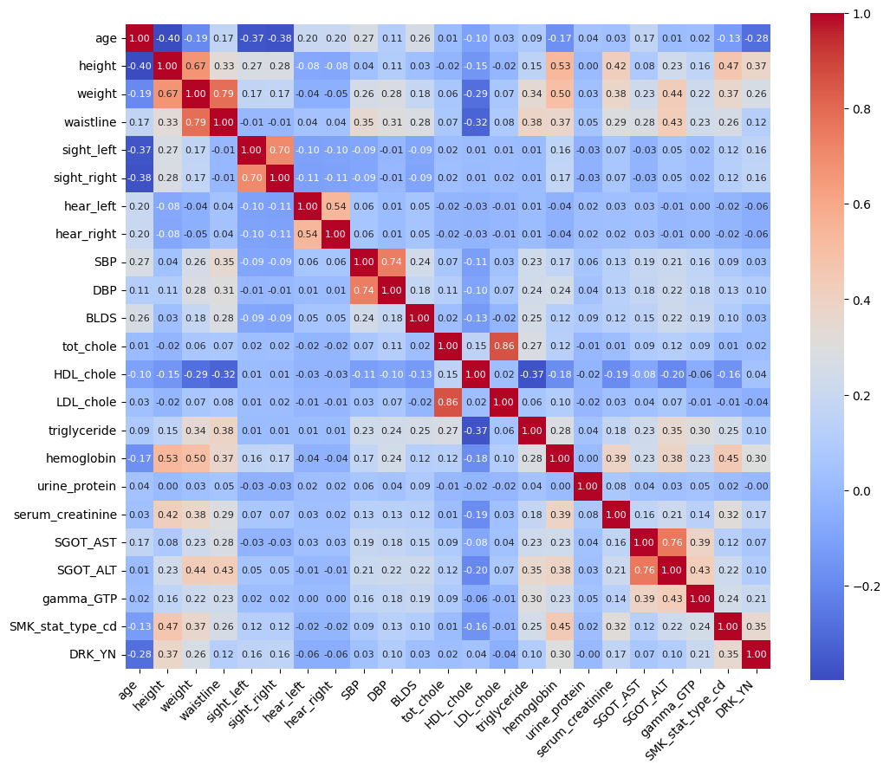
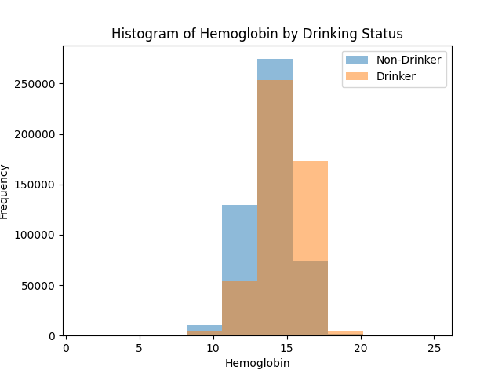
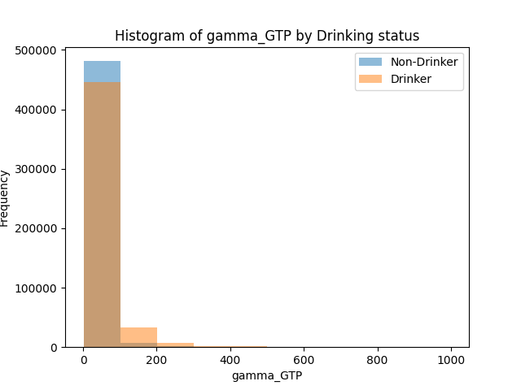
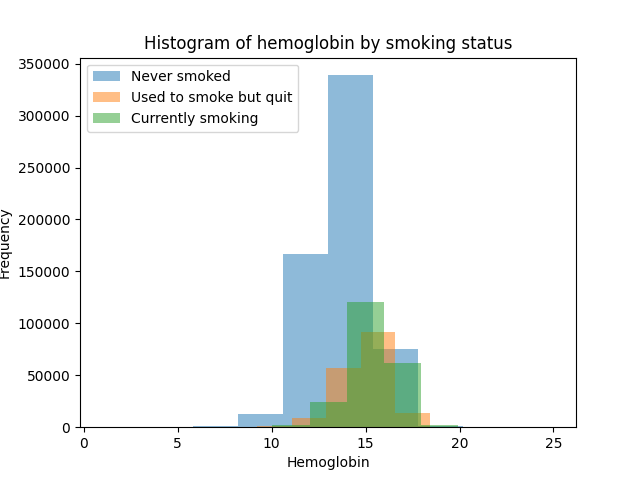

<div align="center">
<h1>ML Task - Round 2</h1>

The final report based on my attempt at this task. Also a documentation of my
thought process during the same.
</div>
Local file with the models: main.py

Unmodified `.csv` file: `original.csv`
Processed `.csv` file: `processed.csv`

---

## (1) Exploratory Data Analysis

#### (i) Scouting

There are no descriptions for any of the columns, but here are my educated guesses:

(O) -> Potential outliers

(G) -> Using an educated guess

(U) -> Unknown meaning/interpretation

| Column Name        | Description                                                                                          |
|--------------------|------------------------------------------------------------------------------------------------------|
| sex                | Male -> (M) Female -> (F)                                                                            |
| age                | Measured in years                                                                                   |
| height             | Measured in cm                                                                                      |
| weight             | Measured in kg                                                                                      |
| waistline          | Most likely unit is cm                                                                              |
| sight_left (O)     | Unit unknown. - Most values in [0, 2]. - Outlier at 9.9                                             |
| sight_right (O)    | Unit unknown. - Most values in [0, 2]. - Outlier at 9.9                                             |
| hear_left (G)      | Unit unknown. - Most values in {1, 2}. - 1 likely corresponds to normal hearing, 2 to impaired hearing |
| hear_right (G)     | Unit unknown. - Most values in {1, 2}. - 1 likely corresponds to normal hearing, 2 to impaired hearing |
| SBP                | Systolic Blood Pressure, a measure of blood pressure when the heart beats. Units seem to be mm of mercury. |
| DBP                | Diastolic Blood Pressure, a measure of blood pressure when the heart is at rest. Units seem to be mm of mercury. |
| BLDS (U)           | I have no idea what this is.                                                                         |
| tot_chole          | Total cholesterol level in the blood. Units are likely mg/dl.                                         |
| HDL_chole          | High-Density Lipoprotein (HDL) cholesterol level in the blood. Units are likely mg/dl.               |
| LDL_chole          | Low-Density Lipoprotein (LDL) cholesterol level in the blood. Units are likely mg/dl.               |
| triglyceride       | Triglyceride level in the blood. Units are likely mg/dl.                                           |
| hemoglobin         | Hemoglobin level in the blood. Units are likely g/dl.                                               |
| urine_protein (G)  | Presence or quantity of protein in the urine. - Expressed in single-digit numbers. - Likely proportional to the amount of protein in the urine. |
| serum_creatinine   | Serum creatinine level in the blood, used to assess kidney function. Units are likely mg/dl.         |
| SGOT_AST           | Serum Glutamic Oxaloacetic Transaminase (SGOT/AST) level in the blood, related to liver function. Units are /l. |
| SGOT_ALT           | Serum Glutamic Pyruvic Transaminase (SGPT/ALT) level in the blood, related to liver function. Units are /l. |
| gamma_GTP          | Gamma-Glutamyl Transferase (GGT or gamma-GTP) level in the blood, related to liver and bile duct function. Units are /l. |
| SMK_stat_type_cd (U) | Smoking status or type of smoking. Values in {1, 2, 3}. Further analysis is required to determine what each number could represent. |
| DRK_YN             | Drinking status. Y (Yes), N (No).                                                                    |

#### (ii) Data Cleansing process

##### (a) Removing null values and duplicates

File: `EDA/null_check.py`

```python
import pandas as pd

df = pd.read_csv("../original.csv")

missing_values = df.isnull().sum()

print("Columns with missing values: ")
for column, count in missing_values.items():
    if count > 0:
        print(f"{column}: {count} missing values")
```

No missing values were found

File: `EDA/duplicates.py`

```python

df = pd.read_csv("../original.csv")
print(df[df.duplicated].shape)  # (26, 24) -> 26 duplicates for 24 columns
print(df.describe())
df = df.drop_duplicates(keep="first")
df.to_csv("../processed.csv", index=False)
print(df.describe())
```

Removing duplicates is necessary because it prevents over-fitting, especially when
they are large in number (26 does not cut it though)

##### (b) Addressing outliers

The best method according to most sources is using the interquartile range
approach to detect outliers.
First we start by generating the box plot for every column

File: `EDA/outliers.py`

Images: `EDA/img`

```python
def generate_box_plot(column_name):
    plt.figure(figsize=(10, 6))
    plt.boxplot(df[column_name], vert=False)
    plt.title("Box Plot for " + column_name)
    plt.xlabel(column_name)
    plt.savefig("./img/box_plot_" + column_name + ".png")
    return 0

for column in column_names:
    generate_box_plot(column)
```

where the column_names are defined as:

```python
column_names = [
    "age",
    "height",
    "weight",
    "waistline",
    "sight_left",
    "sight_right",
    "hear_left",
    "hear_right",
    "SBP",
    "DBP",
    "BLDS",
    "tot_chole",
    "HDL_chole",
    "LDL_chole",
    "triglyceride",
    "hemoglobin",
    "urine_protein",
    "serum_creatinine",
    "SGOT_AST",
    "SGOT_ALT",
    "gamma_GTP",
]
```

Then we remove outliers for the following columns:

```python

columns_to_be_removed = [
    "sight_left",
    "sight_right",
    "waistline",
    "SBP",
    "DBP",
    "BLDS",
    "tot_chole",
    "triglyceride",
    "serum_creatinine",
    "SGOT_AST",
    "SGOT_ALT",
]
```

`gamma_GTP` was intentionally left out because I feel like I'd loose a lot of
data considering this box plot:


Honestly some of the parameters like `SGOT_AST` really seem important, as a
higher value indicates something related to
alcohol consumption, but I can't really tell how important each entry is,
without a domain expert.

I also have a suspicion that `sight_left` and `sight_right` must lie in (0, 1],
but I have no way to confirm this.

##### (c) Converting data types

`DRK_YN` contains entires in {"Y", "N"}, so I will convert them into {1, 0}

File: `EDA/convert.py`

```python
df = pd.read_csv("../processed.csv")

df["DRK_YN"] = df["DRK_YN"].replace({"Y": 1, "N": 0})
df.to_csv("../processed.csv", index=False)
```

##### (d) Feature engineering

This is just adding useful columns derived from other related columns
The height and weight are useful parameters for this test, but I think
it's better if we just combine them and use the BMI instead.

The formula for BMI is $\beta = \frac{\text{Mass(kg)}}{\text{Height(m)}^2}$
So I'm going to add this column next to the weight and height
From the scouting, the height is in `cm`, so this needs to be accounted for.

File: `EDA\feature_engg.py`

```python
df = pd.read_csv("../processed.csv")
df["bmi"] = round(df["weight"] / ((df["height"] / 100) ** 2), 2)

columns_order = [
    "sex",
    "age",
    "height",
    "weight",
    "bmi",
    "waistline",
    "sight_left",
    "sight_right",
    "hear_left",
    "hear_right",
    "SBP",
    "DBP",
    "BLDS",
    "tot_chole",
    "HDL_chole",
    "LDL_chole",
    "triglyceride",
    "hemoglobin",
    "urine_protein",
    "serum_creatinine",
    "SGOT_AST",
    "SGOT_ALT",
    "gamma_GTP",
    "SMK_stat_type_cd",
    "DRK_YN",
]

df = df[columns_order]
df.to_csv("../processed.csv", index=False)
```

The BMI (rounded off to two decimal) reports is now present next to the weight column

The columns seem to be meaningful in name, and there is only numerical input, so
this concludes my preliminary EDA.

---

## (2) Data plotting

The objective is to check the relationship between various entries in the dataset
I will try generating pair plots,
heatmaps, histograms

##### (a) Pair plots

This consumed all of my RAM, and took an hour to perform:

File: `DP/pair_plots.py`

Image: `DP/img/pair_plot.png`


```python
import matplotlib.pyplot as plot
import pandas as pd
import seaborn as sb

df = pd.read_csv("../processed.csv")
sb.pairplot(df, diag_kind="kde")
plot.savefig("./img/pair_plot.png")
```

The figure is very detailed, but I am not entirely sure on how to interpret it.
For smoking type, it seems like 1 and 0 are equally as dense.

One relevant feature that I can deduce from this is likely this: In
the smoking status type,
(1) -> Never/Minimal
(2) -> Used to before / less
(3) -> smoker

Relevant parameters seem to be `SGOT_AST` and `SGOT_ALT` for drinking.
Further research suggests that the `SGOT_AST`/`SGOT_ALT` ratio is very
important for drinking detection, so I will add that column.

##### (b) Heatmaps

The heatmap is very useful. We get a good idea of how each column is
corelated with the other

File: `DP/heatmaps.py`

Image: `DP/img/heatmap.py`

```python
df = pd.read_csv("../processed.csv")

columns_to_include = [
    "age",
    "height",
    "weight",
    "waistline",
    "sight_left",
    "sight_right",
    "hear_left",
    "hear_right",
    "SBP",
    "DBP",
    "BLDS",
    "tot_chole",
    "HDL_chole",
    "LDL_chole",
    "triglyceride",
    "hemoglobin",
    "urine_protein",
    "serum_creatinine",
    "SGOT_AST",
    "SGOT_ALT",
    "gamma_GTP",
    "SMK_stat_type_cd",
    "DRK_YN",
]

df_subset = df[columns_to_include]

plot.figure(figsize=(12, 10))

heatmap = sns.heatmap(
    df_subset.corr(),
    annot=True,
    cmap="coolwarm",
    fmt=".2f",
    annot_kws={"size": 8},
)

heatmap.set_xticklabels(
    heatmap.get_xticklabels(),
    rotation=45,
    horizontalalignment="right",
)

heatmap.set_aspect("equal")
plot.savefig("./img/heatmap.png", bbox_inches="tight")
```



#### (c) Histograms

Some histograms plotted are as follows:

File: `DP/histogram.py`

Images: `DP/img/*_histogram.py`

```python

df = pd.read_csv("../processed.csv")
plot.hist(df[df["column_1"] == 0]["column_2"], alpha=0.5, label="label1")
plot.hist(df[df["column_1"] == 1]["column_2"], alpha=0.5, label="label2")
plot.xlabel("column_2")
plot.ylabel("Frequency")
plot.legend()
```





All matching with the heatmap, which was by far the most useful

---

### (3) Model Making

Note: I'm on a terminal environment, so memory consumption is not something I'll
be including in this analysis. This is primarily because I do not have access
to the magic `%memit` command or an equivalent, and the standard ways of
measuring memory consumption would be dependent on my virtual environment's python
interpreter and the processes running on my laptop

#### (i) Linear Regression or Logistic Regression

File: `models/linear_regression.py`

```python
import time
import pandas as pd
from sklearn.model_selection import train_test_split
from sklearn.linear_model import LinearRegression
from sklearn.metrics import accuracy_score, classification_report

start_time = time.time()

df = pd.read_csv("../processed.csv")
X = df.drop(columns=["DRK_YN", "sex"], axis=1)
y = df.DRK_YN

X_train, X_test, y_train, y_test = train_test_split(
    X, y, test_size=0.2, random_state=69
)

model = LinearRegression()
model.fit(X_train, y_train)

y_pred = model.predict(X_test)
accuracy = accuracy_score(y_test, y_pred.round())
report = classification_report(y_test, y_pred.round())

print(f"Accuracy: {accuracy:.2f}")
print("Classification Report:")
print(report)

end_time = time.time()
elapsed_time = end_time - start_time

print(f"Time taken: {elapsed_time:.2f} seconds")
```

The result is as follows:

```bash
Accuracy: 0.72
Classification Report:
              precision    recall  f1-score   support

        -2.0       0.00      0.00      0.00         0
        -1.0       0.00      0.00      0.00         0
         0.0       0.71      0.74      0.73     98304
         1.0       0.73      0.69      0.71     97861
         2.0       0.00      0.00      0.00         0

    accuracy                           0.72    196165
   macro avg       0.29      0.29      0.29    196165
weighted avg       0.72      0.72      0.72    196165

Time taken: 1.87 seconds
```

What is a linear regression model, and how did this work?

How to interpret this information

##### (ii) Support Vector Machine

File: `models/svm.py`

```python

import time
import pandas as pd
from sklearn.model_selection import train_test_split
from sklearn.svm import SVC
from sklearn.metrics import accuracy_score, classification_report

start_time = time.time()

df = pd.read_csv("../processed.csv")
X = df.drop(columns=["DRK_YN", "sex"], axis=1)
y = df.DRK_YN

X_train, X_test, y_train, y_test = train_test_split(
    X, y, test_size=0.2, random_state=69
)

svmc = SVC(kernel="rbf", C=1.0)
svmc.fit(X_train, y_train)


y_pred = svmc.predict(X_test)
accuracy = accuracy_score(y_test, y_pred.round())
report = classification_report(y_test, y_pred.round())

print(f"Accuracy: {accuracy:.2f}")
print("Classification Report:")
print(report)

end_time = time.time()
elapsed_time = end_time - start_time

print(f"Time taken: {elapsed_time:.2f} seconds")

```

I did not know the underlying distribution, so I choose a radial basis function
for my kernel.

##### (iii) Random Forest Classifiers

File: `models/random_forests.py`

```python
import time
import pandas as pd
from sklearn.model_selection import train_test_split
from sklearn.ensemble import RandomForestClassifier
from sklearn.metrics import accuracy_score, classification_report

start_time = time.time()

df = pd.read_csv("../processed.csv")
X = df.drop(columns=["DRK_YN", "sex"], axis=1)
y = df.DRK_YN

X_train, X_test, y_train, y_test = train_test_split(
    X, y, test_size=0.2, random_state=69
)

model = RandomForestClassifier(n_estimators=100, random_state=69, n_jobs=-1)
model.fit(X_train, y_train)

y_pred = model.predict(X_test)
accuracy = accuracy_score(y_test, y_pred)
report = classification_report(y_test, y_pred)

print(f"Accuracy: {accuracy:.2f}")
print("Classification Report:")
print(report)

end_time = time.time()
elapsed_time = end_time - start_time

print(f"Time taken: {elapsed_time:.2f} seconds")
```

The result is as follows

```bash
Accuracy: 0.73
Classification Report:
              precision    recall  f1-score   support

           0       0.73      0.74      0.73     98304
           1       0.73      0.72      0.73     97861

    accuracy                           0.73    196165
   macro avg       0.73      0.73      0.73    196165
weighted avg       0.73      0.73      0.73    196165

Time taken: 84.89 seconds
```

##### (iv) Neural Networks
